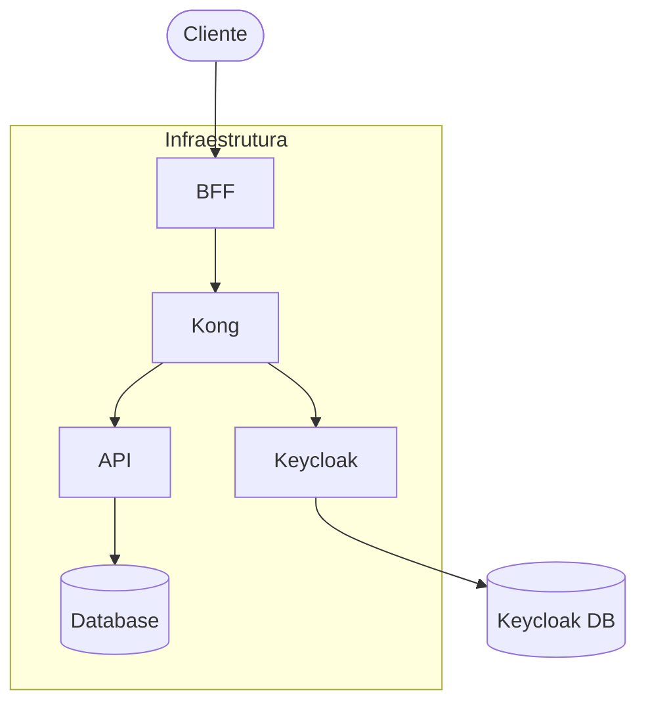
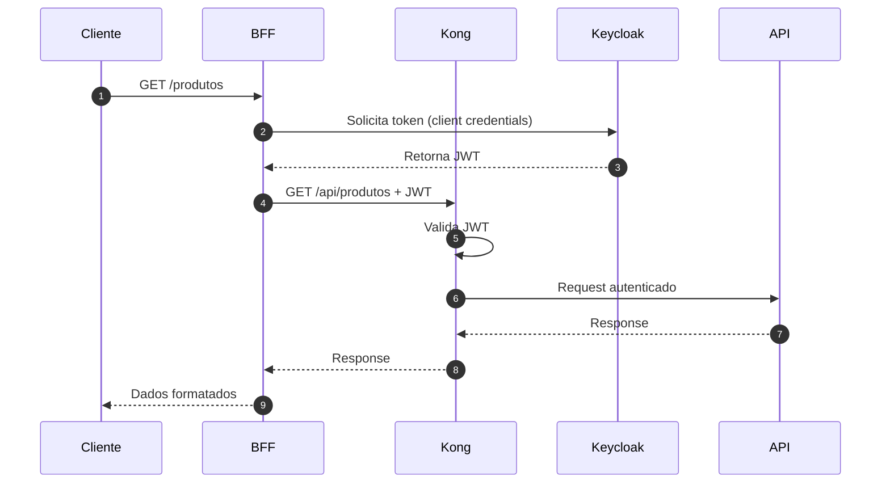
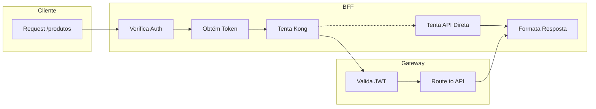
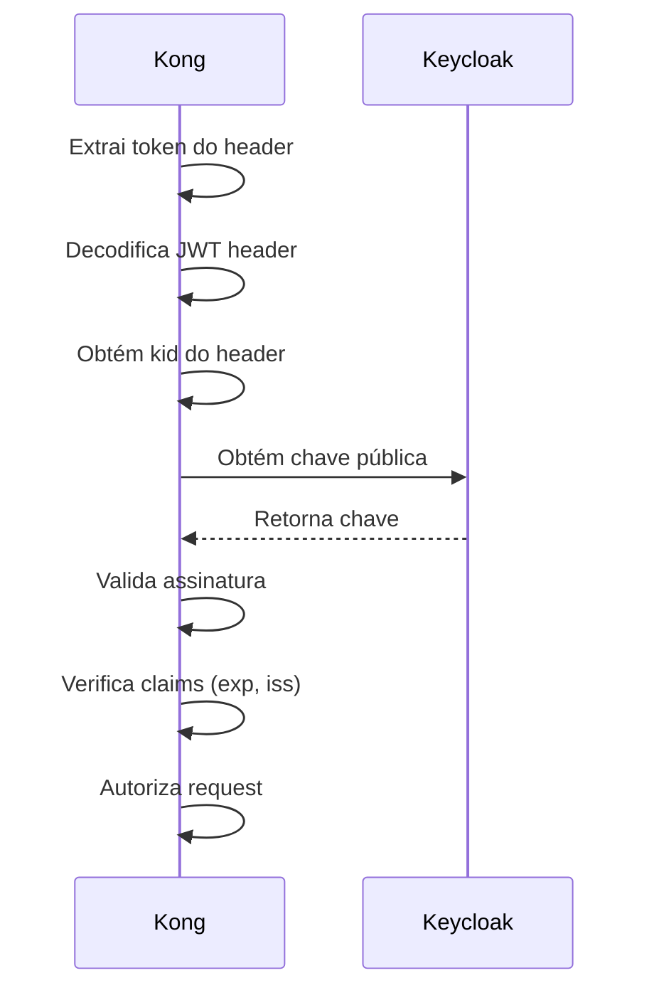
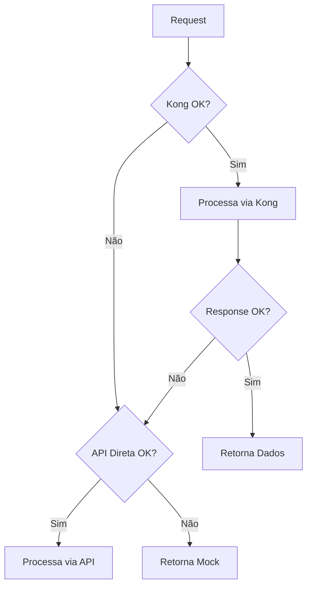

## 1. Visão Geral da Arquitetura


## 2. Fluxo de Autenticação


## 3. Fluxo de Requisições


## 4. Validação de Token


## 5. Tratamento de Erros


## 6. Processo de Fallback
```mermaid
stateDiagram-v2
    [*] --> TentandoKong
    TentandoKong --> KongSucesso: OK
    TentandoKong --> TentandoAPI: Falha
    TentandoAPI --> APISucesso: OK
    TentandoAPI --> UsandoMock: Falha
    KongSucesso --> [*]: Retorna Dados
    APISucesso --> [*]: Retorna Dados
    UsandoMock --> [*]: Retorna Mock