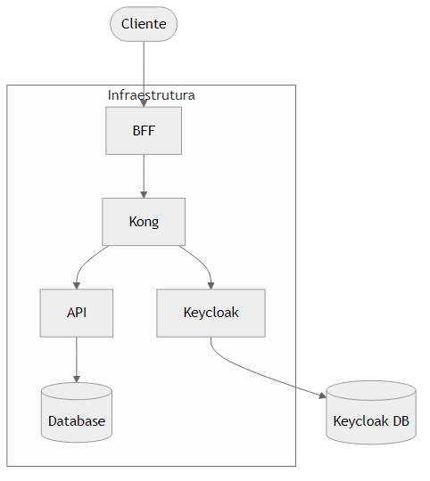
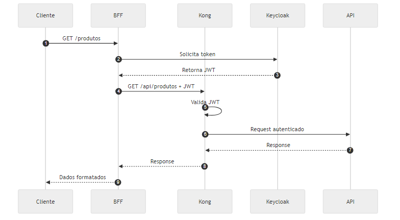
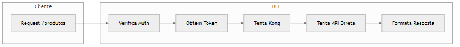
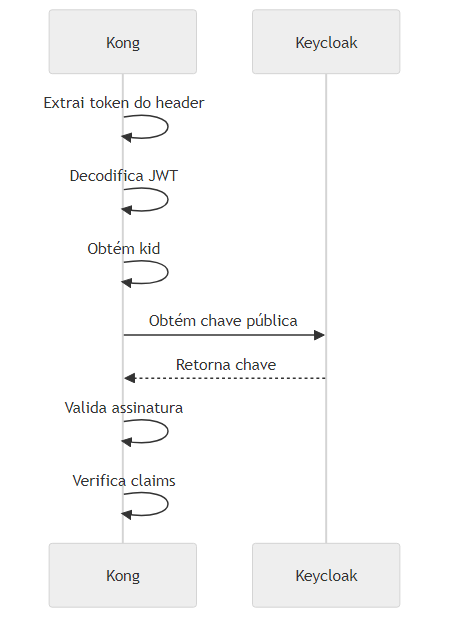
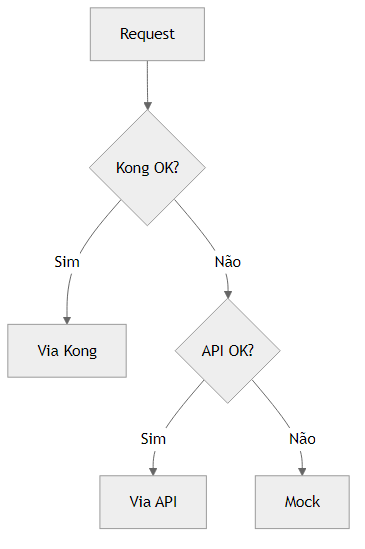
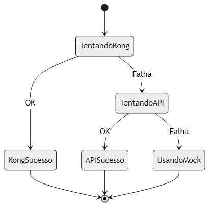

# Arquitetura de Microsserviços com BFF, Kong, Keycloak e API

## Índice
1. [Visão Geral](#1-visão-geral)
2. [Diagramas de Arquitetura](#2-diagramas-de-arquitetura)
3. [Componentes](#3-componentes)
4. [Geração de Diagramas](#4-geração-de-diagramas)
5. [Estrutura do Projeto](#5-estrutura-do-projeto)

## 1. Visão Geral
A arquitetura implementa um padrão de microsserviços seguro e escalável usando BFF, Kong, Keycloak e API REST.



## 2. Diagramas de Arquitetura

### 2.1 Fluxo de Autenticação
O processo de autenticação e autorização entre os componentes:



### 2.2 Fluxo de Requisições
Como as requisições são processadas através dos diferentes componentes:



### 2.3 Validação de Token
Processo detalhado de validação de tokens JWT pelo Kong:



### 2.4 Tratamento de Erros
Fluxo de tratamento de erros em diferentes níveis:



### 2.5 Processo de Fallback
Sistema de fallback implementado no BFF:



## 3. Componentes

### 3.1 BFF (Backend for Frontend)
- **Porta**: 8080
- **Tecnologia**: PHP/Apache
- **Responsabilidades**:
  - Intermediar comunicação cliente-servidor
  - Gerenciar tokens
  - Implementar fallbacks
  - Formatar respostas

### 3.2 Kong (API Gateway)
- **Portas**: 
  - 8000 (Proxy)
  - 8001 (Admin API)
- **Responsabilidades**:
  - Rotear requisições
  - Validar tokens JWT
  - Proteger endpoints
  - Gerenciar tráfego

### 3.3 Keycloak
- **Porta**: 8082
- **Responsabilidades**:
  - Autenticação de usuários
  - Emissão de tokens JWT
  - Gerenciamento de realms e clientes
  - Controle de acessos

### 3.4 API
- **Porta**: 8081
- **Tecnologia**: PHP/Apache
- **Responsabilidades**:
  - Processar requisições
  - Validar autenticação
  - Retornar dados
  - Logging e debug

### 3.5 Opções de Autenticação
As três opções de autenticação disponíveis são:

Password Grant

É o fluxo mais comum para aplicações que confiam diretamente no authorization server
O usuário fornece suas credenciais (username/password) diretamente para a aplicação
Ideal para aplicações first-party (desenvolvidas pela mesma organização)
Usado quando há alto nível de confiança entre o client e o authorization server
Client Credentials

Fluxo para comunicação entre sistemas (M2M - Machine to Machine)
Não envolve um usuário final, apenas credenciais do client
Ideal para APIs e serviços em background
Usado quando um sistema precisa acessar seus próprios recursos
Não requer interação do usuário
Authorization Code

Fluxo mais seguro para aplicações web e mobile
O usuário é redirecionado para o servidor de autorização (Keycloak)
As credenciais são fornecidas diretamente ao authorization server
O client recebe um código que é trocado por tokens
Ideal para aplicações third-party
Implementa o conceito de consentimento do usuário
Estas três opções foram escolhidas por serem os fluxos mais comuns do OAuth2/OpenID Connect e cobrirem a maioria dos casos de uso em arquiteturas modernas:

Aplicações internas (Password Grant)
Integrações de sistema (Client Credentials)
Aplicações externas (Authorization Code)

## 4. Geração de Diagramas

### 4.1 Pré-requisitos
- Node.js instalado
- NPM disponível

### 4.2 Instalação
```bash
npm install -g @mermaid-js/mermaid-cli
```

### 4.3 Gerando Diagramas

#### Windows (PowerShell - Recomendado)
```powershell
.\scripts\Generate-Diagrams.ps1
```

#### Windows (Batch)
```batch
scripts\gerar-diagramas.bat
```

#### Linux/Mac
```bash
chmod +x scripts/generate-diagrams.sh
./scripts/generate-diagrams.sh
```

## 5. Estrutura do Projeto

```plaintext
.
├── api/
│   ├── public/
│   │   ├── index.php
│   │   └── .htaccess
│   ├── Dockerfile
│   └── 000-default.conf
├── bff/
│   ├── public/
│   │   └── index.php
│   └── Dockerfile
├── scripts/
│   ├── configure-kong.sh
│   ├── configure-keycloak.sh
│   ├── generate-diagrams.sh
│   ├── Generate-Diagrams.ps1
│   └── gerar-diagramas.bat
├── images/
│   ├── png/
│   │   └── *.png
│   └── diagrams.md
└── docker-compose.yml
```

## 6. Inicialização
- docker compose build
- docker compose up -d
